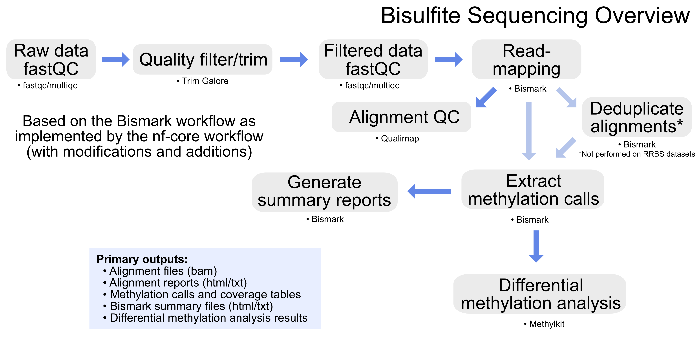

# GeneLab bioinformatics processing pipeline for Methylation Sequencing (Methyl-Seq) data

> **The document [`GL-DPPD-XXXX.md`](Pipeline_GL-DPPD-XXXX_Versions/GL-DPPD-XXXX.md) holds an overview and example commands for how GeneLab processes Methylation Sequencing (Methyl-Seq) data generated using the reduced-representation bisulfite sequencing (RRBS-Seq) process. Processed data output files and a GeneLab data processing summary is provided for each GLDS dataset in the [GeneLab Data Systems (GLDS) repository](https://genelab-data.ndc.nasa.gov/genelab/projects). 

---

** Note: The [`GL-DPPD-XXXX.md`](Pipeline_GL-DPPD-XXXX_Versions/GL-DPPD-XXXX.md) pipeline is currently in a draft form ready for review. Example output files for reviewers can be found [here](https://drive.google.com/drive/folders/11fEFOn1Br6wJ4g_zBJ0ZkOGPEUxl07ZE?usp=sharing).**

---

--- 

## Repository Links

* [**Pipeline_GL-DPPD-XXXX_Versions**](Pipeline_GL-DPPD-XXXX_Versions)

  - Contains the current and previous GeneLab Methyl-Seq consensus processing pipeline (MSCP) versions documentation

* [**Methyl-Seq_Tool_Install**](Methyl-Seq_Tool_Install)

  - Contains instructions and associated yaml files to install the conda environments containing tools used to process Methyl-Seq datasets using the GeneLab MSCP

* [**Workflow_Documentation**](Workflow_Documentation)

  - Contains instructions for installing and running the GeneLab MSCP workflow
    > Note: The MSCP workflow is currently in development and not yet available 

* [**GLDS_Processing_Scripts**](GLDS_Processing_Scripts)

  - Contains the exact processing commands and MSCP version used for specific GLDS datasets that have been released and are available in the [GeneLab Data Systems (GLDS) repository](https://genelab-data.ndc.nasa.gov/genelab/projects)

---
**Developed and maintained by:**  
Michael Lee
