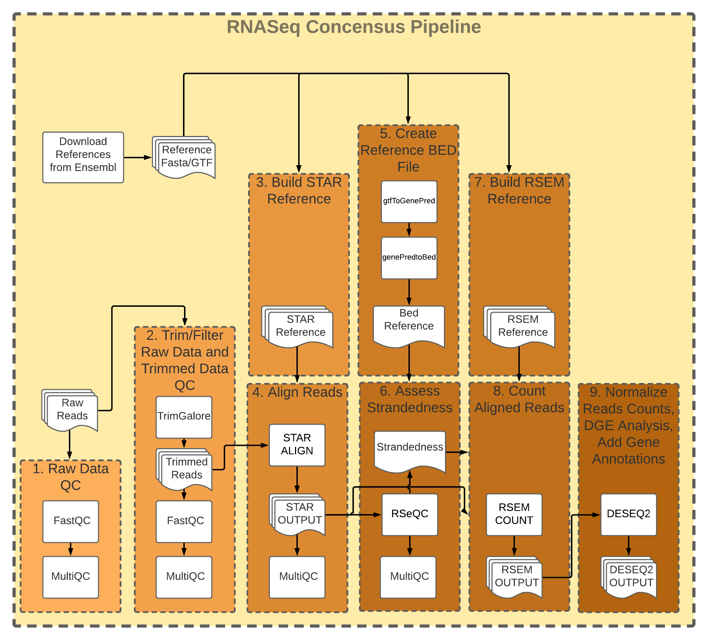

# GeneLab bioinformatics processing pipeline for Illumina RNA-sequencing data

> **The document [`GL-DPPD-7101-E.md`](Pipeline_GL-DPPD-7101_Versions\GL-DPPD-7101-E.md) holds an overview and instructions for how GeneLab processes RNAseq datasets. Previous GL-DPPD-7101 revisions are available in the [Pipeline_GL-DPPD-7101_Versions](Pipeline_GL-DPPD-7101_Versions) sub-directory. Exact processing commands and GL-DPPD-7101 revision used for specific datasets that have been released are available in the [GLDS_Processing_Scripts](GLDS_Processing_Scripts) sub-directory and are also provided with their processed data in the [GeneLab Data Systems (GLDS) repository](https://genelab-data.ndc.nasa.gov/genelab/projects).**  

---

**RNASeq processing pipeline & Nextflow workflow implementation developed and maintained by:**

- Jonathan Oribello (Jonathan.D.Oribello@nasa.gov)
- Amanda Saravia-Butler (Amanda.M.Saravia-Butler@nasa.gov)

---

---

# Repository links

- [Current processing protocol (GL-DPPD-7101-E.md)](Pipeline_GL-DPPD-7101_Versions\GL-DPPD-7101-E.md)
- [Processed dataset files](GLDS_Processing_Scripts)
- [Workflow files](workflow_code)
- [Workflow information and usage instructions](workflow-usage.md)
