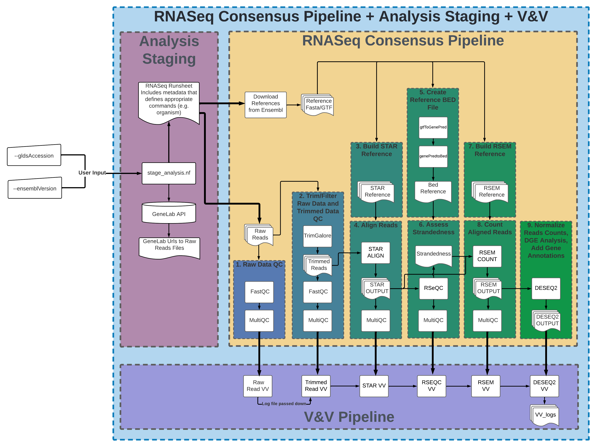
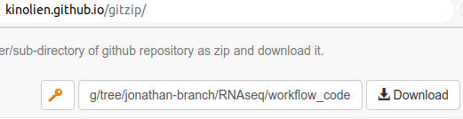

# NF_RCP-F Workflow Information and Usage Instructions

## General Workflow Info

### Implemenation Tools

The current GeneLab RNAseq consensus processing pipeline (RCP), [GL-DPPD-7101-F](../../Pipeline_GL-DPPD-7101_Versions/GL-DPPD-7101-F.md), is implemented as a [Nextflow](https://nextflow.io/) DSL2 workflow that utilizes [conda](https://docs.conda.io/en/latest/) environments. This workflow (NF_RCP-F) is run using the command line interface (CLI) of any unix-based system.  While knowledge of creating workflows in Nextflow is not required to run the workflow as is, [the Nextflow documentation](https://nextflow.io/docs/latest/index.html) is a useful resource for users who want to modify and/or extend this workflow. An introduction to conda with installation help and links to other resources can be found [here at Happy Belly Bioinformatics](https://astrobiomike.github.io/unix/conda-intro).  

### Workflow & Subworkflows

---

- **Click image to expand**

<p align="center">
<a href="../../images/NF_RCP-F_rnaseq_workflow.png"></a>
</p>

---
The NF_RCP-F workflow is composed of three subworkflows as shown in the image above.
Below is a description of each subworkflow and the additional output files generated that are not already indicated in the [GL-DPPD-7101-F pipeline 
document](../../Pipeline_GL-DPPD-7101_Versions/GL-DPPD-7101-F.md):

1. **Analysis Staging Subworkflow**

   - Description:
     - This subworkflow extracts the metadata parameters (e.g. organism, library layout) needed for processing from the GLDS ISA archive and retrieves the raw reads files hosted on the [GeneLab Data Repository](https://genelab-data.ndc.nasa.gov/genelab/projects).
       > *GLDS ISA archive*: ISA directory containing Investigation, Study, and Assay (ISA) metadata files for a respective GLDS dataset - the *ISA.zip file is located in the [GLDS repository](https://genelab-data.ndc.nasa.gov/genelab/projects) under 'STUDY FILES' -> 'Study Metadata Files' for any GLDS dataset in the GeneLab Data Repository.

2. **RNASeq Consensus Pipeline Subworkflow**

   - Description:
     - This subworkflow uses the staged raw data and metadata parameters from the Analysis Staging Subworkflow to generate processed data using [version F of the GeneLab RCP](../../Pipeline_GL-DPPD-7101_Versions/GL-DPPD-7101-F.md).

3. **V&V Pipeline Subworkflow**

   - Description:
     - This subworkflow performs validation and verification (V&V) on the raw and processed data files in real-time.  It performs a series of checks on the output files generated and flags the results, using the flag codes indicated in the table below, which outputted as a series of log files. 
     
       **V&V Flags**:

       |Flag Codes|Flag Name|Interpretation|
       |:---------|:--------|:-------------|
       | 20-29    | GREEN   | Indicates the check passed all validation conditions |
       | 30-39    | YELLOW  | Indicates the check was flagged for minor issues (e.g. slight outliers) |
       | 50-59    | RED     | Indicates the check was flagged for moderate issues (e.g. major outliers) |
       | 80-89    | HALT    | Indicates the check was flagged for severe issues that trigger a processing halt (e.g. missing data) |

<br>

---
## Utilizing the Workflow

1. [Install Conda and Nextflow](#1-install-conda-and-nextflow)  
2. [Download the Workflow Files](#2-download-the-workflow-files)  
3. [Setup Execution Permission for Workflow Scripts](#3-setup-execution-permission-for-workflow-scripts)  
4. [Run the Workflow](#4-run-the-workflow)
5. [Additional Output Files](#5-additional-output-files)
6. [Known Issues](#6-known-issues)

### 1. Install Conda and Nextflow (**CHANGE TO SINGULARITY INSTALL INSTRUCTIONS**)

We recommend installing a Miniconda, Python3 version appropriate for your system, as instructed by [Happy Belly Bioinformatics](https://astrobiomike.github.io/unix/conda-intro#getting-and-installing-conda).  

Once conda is installed on your system, you can install the latest version of Nextflow by running the following commands:

```bash
conda install -c bioconda nextflow
nextflow self-update
```

### 2. Download the Workflow Files

All files required for utilizing the NF_RCP-F GeneLab workflow for processing RNASeq data are in the [workflow_code](workflow_code) directory. To get a 
copy of latest NF_RCP-F version on to your system, copy the github web address of the [latest NF_RCP-F version](workflow_code/NF_RCP-F_1.0.0), then paste it into [GitZip here](http://kinolien.github.io/gitzip/), and click download:

TODO: Update image when we have the official NASA GitHub link - alternatively create script that can be run to do this automatically
<p align="center">
<a href="../../images/NF_RCP-F_gitzip_rnaseq.png"></a>
</p>

### 3. Setup Execution Permission for Workflow Scripts

Once you've downloaded the NF_RCP-F workflow directory as a zip file, unzip the workflow then `cd` into the NF_RCP-F directory on the CLI. Next, run the following command to set the execution permissions for all scripts in the bin folder:

```bash
chmod -R u+x bin
```

### 4. Run the Workflow

While in the NF_RCP-F workflow directory, you are now able to run the workflow. Below are two examples of how to run the NF_RCP-F workflow:
> Note: Nextflow commands use both single hyphen arguments (e.g. -help) that denote general nextflow arguments and double hyphen arguments (e.g. --ensemblVersion) that denote workflow specific parameters.  Take care to use the proper number of hyphens for each argument.

**Approach 1: Run the workflow with automatic retrieval of Ensembl reference fasta and gtf files**

```bash
nextflow run ./main.nf --gldsAccession GLDS-194 --ensemblVersion 107
```

**Approach 2: Run the workflow using local Ensembl reference fasta and gtf files**

```bash
nextflow run ./main.nf --gldsAccession GLDS-194 --ensemblVersion 107 --ref_source <ensembl_reference_label>  --ref_fasta </path/to/fasta> --ref_gtf </path/to/gtf>
```
TODO: Remove the --ref_source <ensembl_reference_label> option (here and below) when the workflow is updated to get that info from the runsheet

TODO: If it's possible to run the workflow on a non-GLDS RNAseq dataset, add a 3rd Approach for how to do this, which of course will include providing a user-generated runsheet and raw fastq files

**Required Arguments:**

* `--gldsAccession GLDS-###` – specifies the GLDS dataset to process through the RCP workflow (replace ### with the GLDS number)
* `--ensemblVersion` - specifies the Ensembl version to use for the reference genome (TODO: There should be a default ensemblVersion that is consistent with the ensembl version used for the RCP version the workflow is running, so this can become an optional argument)
  
  
**Optional Arguments:**

* `--help` – show the NF_RCP-F workflow help menu
* `--skipVV` - skip the automated V&V processes (Default: the automated V&V processes are active) 
* `--outputDir` - specifies the directory to save the raw and processed data files (Default: files are saved in the launch directory)
* `--limitSamplesTo` - specifies the number of samples to process (Default: all samples in the GLDS dataset indicated are processed)
* `--genomeSubsample` - specifies an individual chromosome to use for processing (Default: all chromosomes in the fasta/gtf files are used)
* `--truncateTo` - specifies the number of reads to download and process for each sample (Default: all reads are used)
* `--force_single_end` - forces the analysis to use single end processing; for paired end datasets, this means only R1 is used; for single end datasets, this should have no effect
* `--stageLocal TRUE|FALSE` - TRUE = download the raw reads files for the GLDS dataset indicated, FALSE = disable raw reads download and processing (Default: TRUE)
* `--ref_order toplevel|primary_assemblyELSEtoplevel` - specifies which Ensembl fasta file to use, toplevel = use the toplevel fasta, primary_assemblyELSEtoplevel = use the primary_assembly fasta if available but if not, use the toplevel fasta (Default: primary_assemblyELSEtoplevel)
* `--ref_fasta` - specifices the path to a local fasta file (Default: fasta file is downloaded from Ensembl)
* `--ref_gtf` - specifices the path to a local gtf file (Default: gtf file is downloaded from Ensembl)
* `--referenceStorePath` - specifies the directory to store the Ensembl fasta and gtf files (Default: within the directory structure created by default in the launch directory)
* `--derivedStorePath` - specifies the directory to store the tool-specific indices created during processing (Default: within the directory structure created by default in the launch directory)
* `--ref_source` - specifies the ensembl database source (e.g. ensembl, ensembl_plants, ensembl_bacteria) when local reference files are used, required when the `--ref_fasta` and/or `--ref_gtf` options are specified
* `-stub-run` - forces the workflow to use the RSEM `--strandedness none` setting and creates "dummy" gene counts for differential gene expression (DGE) analysis, used in combination with the `--truncateTo` option to avoid V&V errors when evaluating counts and DGE output files during testing 

TODO: Add any optional arguments that are missing
   

See `nextflow run -h` and [Nextflow's CLI run command documentation](https://nextflow.io/docs/latest/cli.html#run) for more options and details common to all nextflow workflows.

---

### 5. Additional Output Files

The output from the Analysis Staging subworkflow and V&V Pipeline subworkflow are described here.
> Note: The outputs from version F of the RNASeq Consensus Pipeline are documented in the current processing protocol, 
[GL-DPPD-7101-F.md](../../Pipeline_GL-DPPD-7101_Versions/GL-DPPD-7101-F.md).

1. Analysis Staging Subworkflow

   - Output:
     - \*_bulkRNASeq_v1_runsheet.csv (a table that include processing parameters and raw reads files location)
     - \*-ISA.zip (the ISA archive fetched from the GeneLab Data Repository)
     - \*_metadata_table.txt (a table that includes additional information about the GLDS entry, not used for processing)

1. V&V Pipeline Subworkflow

   - Output:
     - VV_Logs/VV_log_final.tsv (A tab-separated values file that includes all V&V flags levels logged)
     - VV_Logs/VV_log_final_only_issues.tsv (A tab-separated values file that includes V&V flags levels logged with maximum flag codes greater than 20)
     - VV_Logs/VV_log_verbose_through_VV_RAW_READS.tsv (A tab-separated values file that includes all V&V flags levels logged, generated after RAW_READS)
     - VV_Logs/VV_log_verbose_through_VV_TRIMMED_READS.tsv (A tab-separated values file that includes all V&V flags levels logged, generated after TRIMMED_READS)
     - VV_Logs/VV_log_verbose_through_VV_STAR_ALIGNMENTS.tsv (A tab-separated values file that includes all V&V flags levels logged, generated after STAR_ALIGNMENTS)
     - VV_Logs/VV_log_verbose_through_VV_RSEQC.tsv (A tab-separated values file that includes all V&V flags levels logged, generated after RSEQC)
     - VV_Logs/VV_log_verbose_through_VV_RSEM_COUNTS.tsv (A tab-separated values file that includes all V&V flags levels logged, generated after RSEM_COUNTS)

---

### 6. Known Issues to Look Out For

#### Truncated Raw Read Files

- This is a known issue for Nextflow file staging from URL.  
- If the Nextflow process is forcefully interrupted while staging a file (most notably raw read files for this pipeline), the truncated file will **NOT** be re-downloaded, resulting in a pipeline trying to process with the truncated file.
- This is most commonly manifests as an unexpected error related to truncation occuring for processes that use the raw read files.
- The advised workaround is to purge the staged files, located in your Nextflow "work" directory under the "stage" sub-directory, and relaunch the pipeline.
