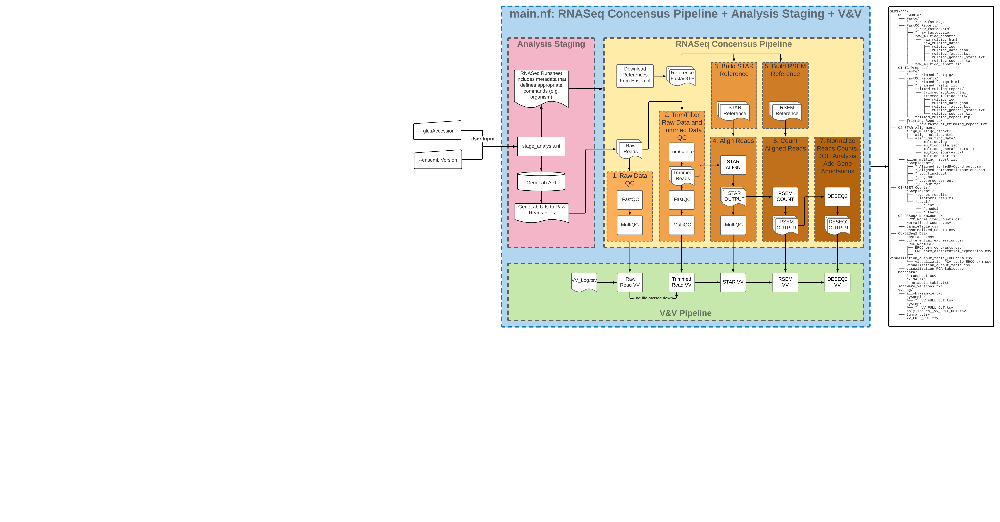

# Workflow information and usage instructions


## General workflow info
### Implemenation Tools
The current processing protocol is implemented as a [Nextflow](https://nextflow.io/) DSL2 workflow and utilizes [conda](https://docs.conda.io/en/latest/) environments. This workflow is run using the CLI of any unix-based system.  While knowledge of creating workflows in Nextflow is not required to run the workflow as is, [the Nextflow documentation](https://nextflow.io/docs/latest/index.html) is a useful resource for users who want to modify and/or extend this workflow. An introduction to conda with installation help and links to other resources can be found [here at Happy Belly Bioinformatics](https://astrobiomike.github.io/unix/conda-intro).  

### Workflow & Subworkflows
---

**Click image to expand**
<p align="center">
<a href="images/rnaseq_pipeline.png"></a>
</p>

---
This workflow is composed of three subworkflows as shown in the image above.
Below is a description of each subworkflow as well as the output files if not listed in the processing protocol:
1. Analysis Staging Subworkflow
  - Description: 
    - This subworkflow extracts the processing parameters (e.g. organism, library layout) from the GLDS ISA archive as well as retrieves the raw reads files hosted on the GeneLab Data Repository.

2. RNASeq Concensus Pipeline Subworkflow
  - Description:
     - This subworkflow uses the staged raw data and processing parameters to generate processed data.
3. V&V Pipeline Subworkflow 
  - Description:
    - This subworkflow performs validation and verification on the raw and processed files.  It performs a series of checks and flags the results to a series of log files. The following flag levels are found in these logs:
---
| Flag ID | Severity              |
|---------|-----------------------|
| 20      | Info-Only             |
| 30      | Passed-Green          |
| 50      | Warning-Yellow        |
| 60      | Warning-Red           |
| 90      | Issue-Halt_Processing |


## Utilizing the workflow

1. [Install conda and Nextflow](#1-install-conda-and-nextflow)  
2. [Download the workflow files](#2-download-the-workflow-files)  
3. [Setup execution permission for bin scripts](#3-setup-execution-permission-for-bin-scripts)  
4. [Run the workflow](#4-run-the-workflow)
5. [Additional Output Files](#5-additional-output-files)
6. [Known Issues](#6-known-issues)


### 1. Install conda and Nextflow
We recommend installing a Miniconda, Python3 version appropriate for your system, as exemplified in [the above link](https://astrobiomike.github.io/unix/conda-intro#getting-and-installing-conda).  

Once conda is installed on your system, you can install the latest version of Nextflow by running the following commands:

```bash
conda install -c bioconda nextflow
nextflow self-update
```

### 2. Download the workflow files
All files required for utilizing the GeneLab workflow for processing RNASeq data are in the [workflow_code](workflow_code) directory. To get a copy of that directory on to your system, copy the github web address of that directory, paste it into [GitZip here](http://kinolien.github.io/gitzip/), and then click download:

<p align="center">
<a href="images/gitzip_rnaseq.png"></a>
</p>

### 3. Setup execution permission for bin scripts
Once you've downloaded the workflow template, you need to set the execution permission for the scripts in the bin folder.  The scripts may be made executable using the following command inside the unzipped workflow_code directory.

```bash
chmod -R u+x bin
```

### 4. Run the workflow

#### Approach 1: Running the workflow with automatic retrieval of Ensembl reference fasta and gtf

Here is one example command of how to run the workflow in using Approach 1.  Note: main.nf is a file located in the workflow_code directory.

> **Note: Nextflow commands use both single hyphen arguments (e.g. -help) that denote general nextflow arguments and double hyphen arguments (e.g. --ensemblVersion) that denote workflow specific parameters.  Take care to use the proper number of hyphens for each argument**  

```
Usage example 1:
   Fetches ensembl reference files via ftp and GeneLab raw data via https before running processing pipeline
   > nextflow run ./main.nf --gldsAccession GLDS-194 --ensemblVersion 96

Usage example 2:
   Fetches GeneLab raw data via https before running processing pipeline using supplied local reference fasta and gtf files.
   Note: ensemblVersion and ref_source are used here to label subdirectories for derived reference files.
   > nextflow run ./main.nf --gldsAccession GLDS-194 --ensemblVersion 96 --ref_source <reference_label>  --ref_fasta </path/to/fasta> --ref_gtf </path/to/gtf>

required arguments:
  --gldsAccession GLDS-000
                        the GLDS accession id to process through the RNASeq Concensus Pipeline.
  --ensemblVersion n    the ensembl Version to use for the reference genome.
optional arguments:
  --help                show this help message and exit
  --skipVV              skip automated V&V processes. Default: false
  --outputDir           directory to save staged raw files and processed files. Default: <launch directory>
  --limitSamplesTo n    limit the number of samples staged to a number.
  --genomeSubsample n   subsamples genome fasta and gtf files to the supplied chromosome.
  --truncateTo n        limit number of reads downloaded and processed to *n* reads , for paired end limits number of reverse and forward read files to *n* reads each.
  --force_single_end    forces analysis to use single end processing.  For paired end datasets, this means only R1 is used.  For single end studies, this should have no effect.
  --stageLocal          download the raw reads files for the supplied GLDS accession id.  Set to false to disable raw read download and processing.  Default: true
  --ref_order           specifies the reference to use from ensembl.  Allowed values:  ['toplevel','primary_assemblyELSEtoplevel']. 'toplevel' : use toplevel.  'primary_assemblyELSEtoplevel' : use primary assembly, but use toplevel if primary assembly doesn't exist. Default: 'primary_assemblyELSEtoplevel'
  --ref_fasta           specifies a reference fasta from a local path. This an is an alternative approach from the automatic retrieval of reference files from ensembl
  --ref_gtf             specifies a reference gtf from a local path. This an is an alternative approach from the automatic retrieval of reference files from ensembl
  --referenceStorePath  specifies the directory where fetched reference files are downloaded to
  --derivedStorePath    specifies the directory where derivative reference files are saved. Examples of such files in this pipeline included BED and PRED files generated from the reference gtf
  --ref_source          a string to label subdirectories in 'StorePath' paths. Examples include 'ensembl' or 'ensembl_plants'.
  -stub-run             runs the workflow forcing 'unstranded' RSEM settings and using dummy gene counts in the differential gene expression (DGE) analysis. Useful when combined with the --truncateTo parameter this often leads to low gene counts and errors in the DGE analysis
```


See `nextflow run -h` and [Nextflow's CLI run command documentation](https://nextflow.io/docs/latest/cli.html#run) for more options and details common to all nextflow workflows.


---

### 5. Additional Output Files

The output from the Analysis Staging subworkflow and V&V Pipeline subworkflow are described here.
Note: the output from the RNASeq Concensus Pipeline are documented in the current processing protocol, (GL-DPPD-7101-C.md)](GL-DPPD-7101-C.md),

1. Analysis Staging Subworkflow
  - Output:
    - \*_runsheet.csv (a table that include processing parameters and raw reads files location)
    - \*-ISA.zip (the ISA archive fetched from the GeneLab Data Repository)
    - \*_metadata_table.txt (a table that includes additional information about the GLDS entry, not used for processing)

2. V&V Pipeline Subworkflow 
  - Output:
    - VV_Log/VV_FULL_OUT.tsv (A tab-separated values file that includes all V&V flags levels logged)
    - VV_Log/only-issues__VV_FULL_OUT.tsv (A tab-separated values file that includes V&V flags levels logged with severities greater than 30)
    - VV_Log/Summary.tsv (A tab-separated values file that summarizes the percent of samples that have Warnings for each step)
    - VV_Log/all-by-sample.txt (A text file that lists, by sample, all flags with severities greater than 30)
    - VV_Log/bySample/{sample_name}__VV_FULL_OUT.tsv (A series of tab-separated values files that subset the full flag log by sample)
    - VV_Log/byStep/{step_name}__VV_FULL_OUT.tsv (A series of tab-separated values files that subset the full flag log by processing step)

---

### 6. Known Issues

## Truncated raw read files
- This is a known issue for Nextflow file staging from URL.  If the Nextflow process is interrupted while staging a file (most notably raw read files for this pipeline), the truncated file will **NOT** be re-downloaded, resulting in a pipeline trying to process with the truncated file.
- This is most common when an unexpected error occurs for a process that uses raw read files.
- The advised workaround is to purge the staged files, located in your Nextflow "work" directory under the "stage" sub-directory, and relaunch the pipeline.
